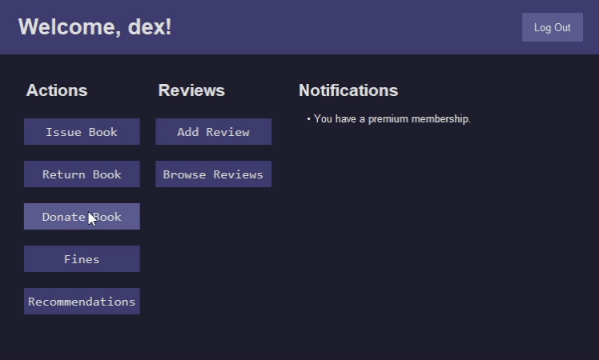
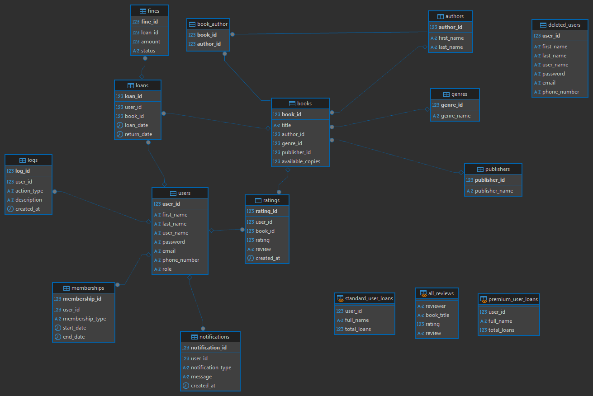

# 📚 System Zarządzania Biblioteką

Projekt Systemu Biblioteki został zrealizowany jako część zaliczenia przedmiotu Bazy Danych na studiach. Głównym celem projektu było zaprojektowanie, zaimplementowanie i zintegrowanie relacyjnej bazy danych z aplikacją napisaną w języku Python. Baza danych została utworzona w środowisku MariaDB, natomiast Python posłużył jako narzędzie do komunikacji z bazą oraz obsługi logiki aplikacji.


---
## 🗺️ Diagram

---
## 📋 Funkcjonalność

### 1. **Rejestracja i logowanie użytkowników**

- Rejestracja i weryfikacja unikalności użytkowników.
- Automatyczne przypisywanie członkostwa (standardowe lub premium).

### 2. **Zarządzanie książkami i wypożyczeniami**

- Obsługa wypożyczeń, zwrotów oraz dotacji książek. 
- Automatyczne naliczanie kar za przetrzymanie.

### 3. **Przeglądanie i dodawanie recenzji.**

- Dodawanie ocen (1–5) i recenzji książek.
- Widok `all_reviews` wyświetla wszystkie recenzje użytkowników.

### 4. **Rekomendacja książek**
Procedura `recommend_books` generuje rekomendacje książek dla użytkownika na podstawie ocen, historii wypożyczeń i preferencji gatunkowych.

- Wybiera 5 gatunków o najwiekszej wadze
   ```sql
   SELECT b.genre_id
   FROM loans l
   JOIN books b ON l.book_id = b.book_id
   WHERE l.user_id = p_user_id
   GROUP BY b.genre_id
   ORDER BY COUNT(*) / (SELECT COUNT(*) FROM loans WHERE user_id = p_user_id) DESC
   LIMIT 5
   ```
- Filtruje według preferowanych gatunków
- Zwraca posortowane malejąco książki o średniej ocenie wiekszej niż 3.5


---

## 📄 Kluczowe elementy projektu

### Tabele w bazie danych:

- **users**: informacje o użytkownikach.
- **books**: zarządzanie książkami.
- **loans**: obsługa wypożyczeń.
- **fines**: naliczanie kar.
- **ratings**: oceny i recenzje użytkowników.

### Procedury:

- **`register_user`**: rejestracja nowego użytkownika.
- **`fetch_unrated_books`**: lista książek wypożyczonych, ale jeszcze nieocenionych.
- **`recommend_books`**: algorytm rekomendacji książek.

### Zdarzenia:

- **`update_fines`**: automatyczne naliczanie kar za przetrzymanie książek.

### Widoki:

- **`all_reviews`**: wyświetla recenzje i oceny użytkowników.
- **`standard_user_loans`** i **`premium_user_loans`**: statystyki wypożyczeń.

---
## 🛠️ Wymagania techniczne

1. **MariaDB 10.3 lub nowsza**

2. **Python 3.8 lub nowszy**
   - Kluczowe biblioteki:
     - `mysql-connector-python`
     - `tkinter`
